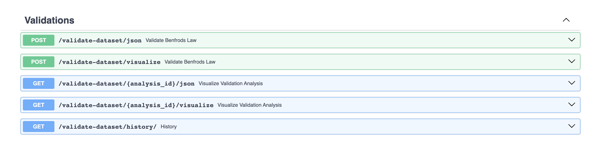

# Benford's Law Web Application

Challenge: Benford's Law

In 1938, Frank Benford published a paper showing the distribution of the leading digit in many disparate sources of data. In all these sets of data, the number 1 was the leading digit about 30% of the time. Benford's law has been found to apply to population numbers, death rates, lengths of rivers, mathematical distributions given by some power law, and physical constants like atomic weights and specific heats.

Create a python-based web application that

1. can parse the attached example file (census_2009) or another flat file with a viable target column. Note that other columns in user-submitted files may or may not be the same as the census data file and users are known for submitting files that don't always conform to rigid expectations. How you deal with files that don't conform to the expectations of the application is up to you, but should be reasonable and defensible.

2. validates Benford's assertion

3. Displays results to the user in a visually interesting manner

The solution should be delivered as a link to a git repository (e.g. hosted via github). The solution should be runnable by L7 by cloning the repository and following any provided instructions.

Stretch goals:

- The solution may be executable via Docker

- The solution allows users to save their data files and results and retrieve them at a later time so they can view data that was tested historically vs. their new data.

- Some level of automated testing (unit or integration)

## Prerequisites

- Python 3.8 or higher
- Docker (optional)

## Getting Started

For this project, I have used python Fast API due to its built in documentation features and fast development. In order to play with this project, Let's do the following:

1. Clone the repository:

   ```bash
   git clone <repository_url>
   cd benfords-law-web-app
   ```

2. Set up a virtual environment (recommended):

   ```bash
   python -m venv l7-assignment
   source l7-assignment/bin/activate # On Windows, use: l7-assignment\Scripts\activate
   ```

   or Using `pyenv`

   ```bash
   pyenv virtualenv 3.8.10 l7-assignment
   ```

   It will automatically be activated due to `.python-version` file.

   Note: `pyenv` needs to be installed before. Besides, I have used Python 3.8.10 for this project.

3. Install dependencies:

   ```bash
   pip install -r requirements.txt
   ```

## Running the Application

To run the application locally, use the following command:

```bash
cd /app
uvicorn main:app --host 0.0.0.0 --port 8000 --reload
```

The application will be accessible at http://localhost:8000 in your web browser.
**Note: It provides the documentation feature of box. http://localhost:8000/docs**

## Application Walkthrough

- Visit the application in your web browser (http://localhost:8000/docs).

  There are 5 apis which are available in this project, providing both responses json as well as graphs for validating the new file or previewing the old file(s).
  

- Upload new file, validate and see results in both json and graph based on the api that is triggered.

  - API POST:`/validate-dataset/json`will give json results for a new file
  - API POST:`/validate-dataset/visualize`will give graph analysis for a new file

- Previewing existing record, validation status and graph by giving id
  - API POST:`/validate-dataset/{analysis_id}/json`will give json results for an existing analysis record
  - API POST:`/validate-dataset/{analysis_id}/visualize`will give json results for an existing analysis record

## Viewing Historical Data

- API `/validate-dataset/history/` will give historical validation results

## Running Automated Tests

To run the automated tests, use the following command:

```bash
pytest tests/
```

## Docker Support (Optional)

If you prefer to run the application in a Docker container, follow these steps:

1. Build the Docker image:

```bash
docker build -t benfords-law-app .
```

2. Run the Docker container:

```bash
docker run -p 8000:8000 benfords-law-app
```

The application will be accessible at http://localhost:5000 in your web browser.

## Cleanup

To stop and remove the Docker container and image (if used), use the following commands:

```bash
docker stop <container_id>
docker rm <container_id>
docker rmi benfords-law-app
```
